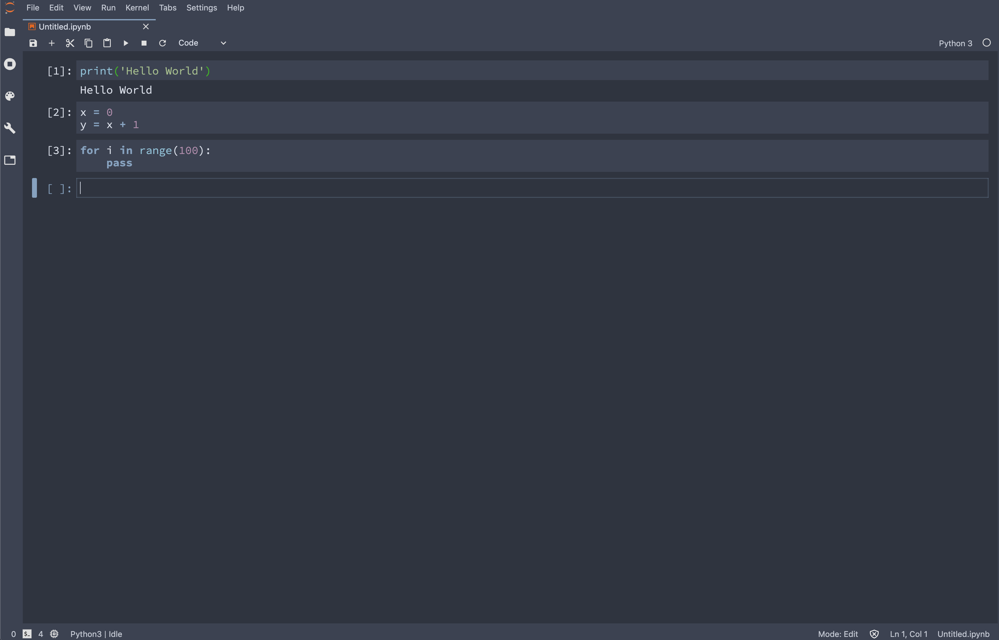

# theme-nord-extension

This is a theme extension for juypterlab based on the [Nord color palette](https://www.nordtheme.com). I recommend Source Han Mono/Souce Code Pro fonts for this theme.




## Prerequisites

* JupyterLab

## Installation

```bash
jupyter labextension install @kenshohara/theme-nord-extension
```

## Development (for me)

For a development install, do the following in the repository directory:

```bash
conda create -n jupyterlab-ext --override-channels --strict-channel-priority -c conda-forge -c anaconda jupyterlab cookiecutter nodejs git
conda activate jupyterlab-ext
jlpm install
jlpm run build
jupyter labextension link .
```
